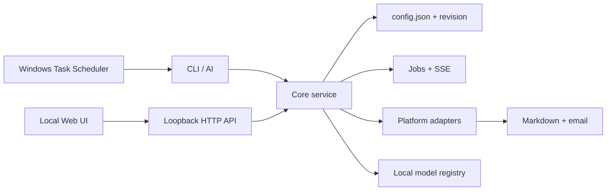

# Architecture

系统是本地优先的双入口应用：Web 控制台、CLI 和 AI 编辑都操作同一份 `config.json`，采集与转录业务由共享 core service 调用。

## Boundaries

- `src/platforms/registry.js` 声明平台能力和来源字段；采集实现仍位于 `src/collectors/` 与 `src/video/`。
- `src/config-store.js` 负责迁移、校验、备份、原子替换和 revision 冲突。
- `src/core/service.js` 是 HTTP 与业务流程之间的边界；HTTP handler 不实现采集逻辑。
- `src/jobs.js` 管理进程内长任务与 SSE。服务重启不会恢复下载 job，但模型下载工具会复用目标目录。
- `src/sessions/manager.js` 把 X、微博的必需登录和 Bilibili 的可选会员登录隔离到 `data/sessions/<platform>.json`。有效的 Bilibili 会话会在本机转换为 yt-dlp 可读的 Netscape Cookie 文件；公开内容始终允许匿名处理。
- Windows 计划任务不依赖 Web 页面存活，它直接运行统一 PowerShell pipeline。

第一版无数据库、无云端账号和无远程控制。跨平台 scheduler、持久 job queue 与更多 ASR 后端是后续扩展点。
